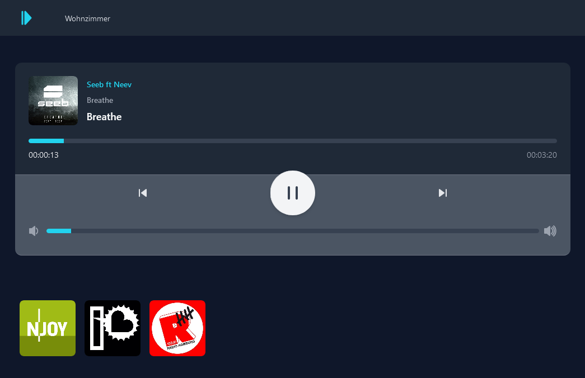

# SONOS Web-Controller

Minimal web controller for the smart speaker by sonos. 
The interface allows starting, stopping and skip the current tracks. 
Moreover, the volume can be changed. Furthermore, predefined radio stations can be played.

This application uses the [SoCO](https://github.com/SoCo/SoCo) library as backend. 

-------

### Preview:



-------

## Features
- shows current track with cover (tested with AirPlay)
- pause/start tracks
- skip tracks
- volume up/down
- play a radio station from a predefined list
- select room (not tested due to lack of speakers)

-------

## Installation
- Download/Clone Repo
- build image 
  ```bash
  docker build --pull --rm -f "DOCKERFILE" -t sonoswebcontroller:latest "."
  ```
- run 
  ```bash
   docker run --rm -d  -p 80:80/tcp --name sonos-web --net=host sonoswebcontroller:latest
  ```
- Visit the website at IP of the host and enjoy 


Or just run app.py with Python :D

-------
## Modify radio stations
- Edit `radio_stations.json`
- Each station needs a unique name and the URL to the stream. 
- Add a link to the cover
### Example:
```json
{
  "Example Radio": {
    "uri": "https://example.com/radio/live/mp3/128/stream.mp3",
    "cover": "https://example.com/radio/c300.png"
  },
  ...
}
```
-------
## License
The Web-Controller is released under the [MIT license](http://www.opensource.org/licenses/mit-license.php).
